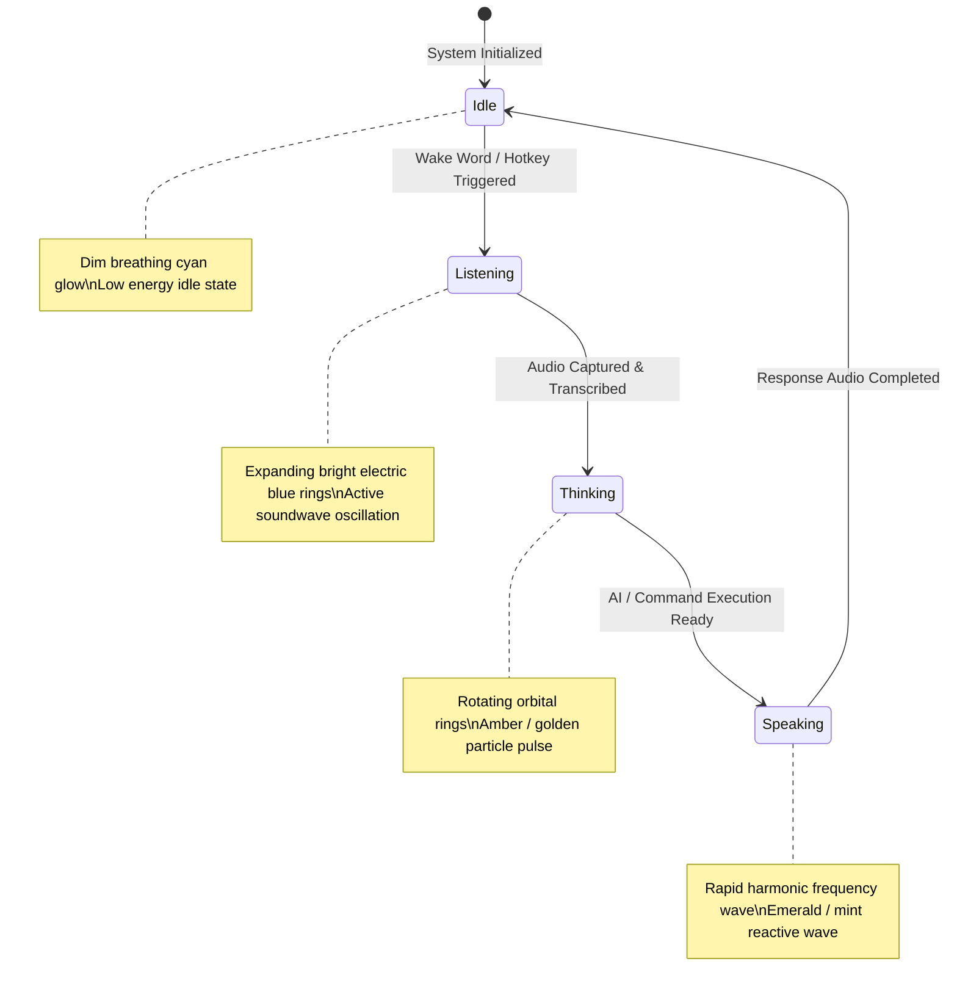
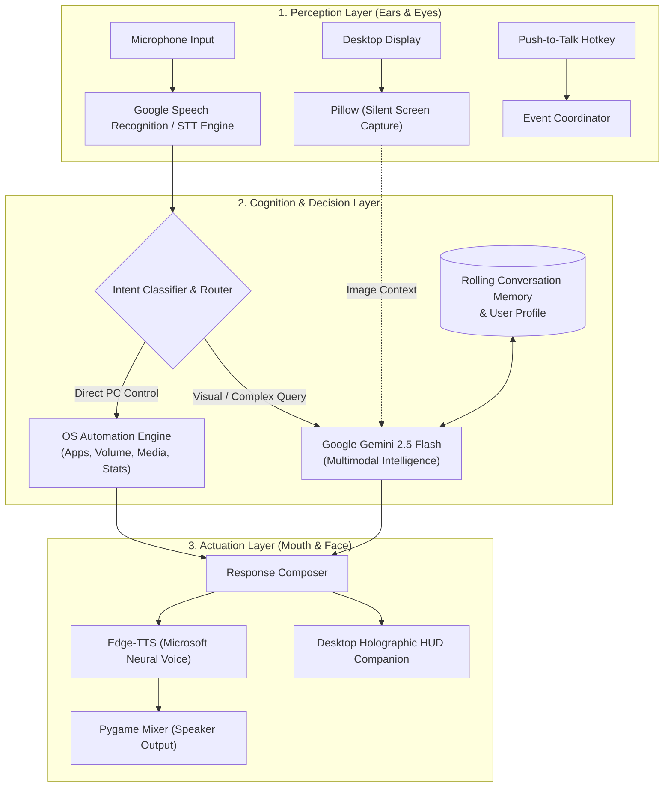

# PROJECT LEO: Next-Generation JARVIS Desktop AI Assistant
## Architecture, Visual Design, & Technical Blueprint

---

---

## 1. Executive Summary

**Project LEO** is a desktop-native, multimodal AI voice assistant inspired by Tony Stark's JARVIS from Iron Man. Unlike traditional toy voice assistants that merely execute static string commands, LEO bridges **ultra-low-latency neural voice interaction**, **multimodal desktop screen vision**, **hardware telemetry telemetry monitoring**, and **deep OS desktop automation** into a sleek, holographic HUD desktop companion.

---

## 2. Visual Architecture & User Experience (HUD)

### 2.1 The Visual Core (Arc Reactor Widget)
The interface is centered around an animated, holographic Arc Reactor core with four dynamic visual states:

### 2.2 Telemetry HUD Modules
LEO's surrounding widgets are functional desktop utilities:
* **System Diagnostics:** Live CPU percentage, RAM consumption, and Battery state powered by `psutil`.
* **Audio Visualizer:** Oscilloscope sound-wave response rendered in real-time.
* **Live Transcript Feed:** Subtitle stream showing what you said and LEO's response.
* **Screen Eye (Vision Status):** An indicator showing when LEO has captured a screen frame for visual reasoning.

---

## 3. High-Level Technical Architecture

---

## 4. Module-by-Module Technical Breakdown

### Module 1: The Ears (`core/listener.py`)
* **Underlying Technology:** `speech_recognition` + `PyAudio`.
* **Ambient Calibration:** At launch, the listener measures background noise (fans, room AC) for 1.2 seconds, establishing a high-pass threshold to eliminate accidental activations.
* **Dual Trigger System:**
  * **Far-field Wake Word:** Continuous background listening for *"Leo"* or *"Hey Leo"*.
  * **Stealth Hotkey:** Holding `Ctrl + Space` immediately engages the mic with zero latency.

### Module 2: The Voice (`core/speaker.py`)
* **Underlying Technology:** `edge-tts` (Microsoft Neural Voice Cloud) + `pygame.mixer`.
* **Latency Optimization:** Voice streams are piped directly to an in-memory or high-speed temporary buffer and played via asynchronous audio threads.
* **Voice Profiles:**
  * **JARVIS Tone:** `en-GB-RyanNeural` or `en-GB-SoniaNeural` (Crisp, sophisticated British cadence).
  * **Tech Assistant:** `en-US-GuyNeural` / `en-US-ChristopherNeural` (Authoritative, modern AI).

### Module 3: The Brain & Vision (`core/brain.py`)
* **Underlying Technology:** `google-genai` SDK (`gemini-2.5-flash`).
* **Multimodal Screen Querying:**
  * When the user asks *"Leo, look at this error"* or *"Leo, what's on my screen?"*, LEO snaps an instantaneous high-res screenshot using `Pillow`, optimizes the resolution, and feeds it into the Gemini vision buffer alongside your question.
* **Context Preservation:** Keeps a rolling memory buffer of recent exchanges so conversations flow naturally without repeating yourself.

### Module 4: Hardware & OS Powers (`core/system_control.py`)
* **Underlying Technology:** `psutil`, `pyautogui`, `subprocess`, `webbrowser`.
* **Capabilities:**
  * Application launching (VS Code, Chrome, Terminal, Spotify).
  * Volume & media playback control (Play, pause, skip, mute).
  * Telemetry monitoring: Real-time CPU, RAM, battery, and system temperature reports.

### Module 5: The Desktop HUD (`ui/hud.py`)
* **Underlying Technology:** Modern GUI engine with transparent alpha-channel window masking (`-topmost`, borderless).
* **Display Behavior:** Floats smoothly on the desktop, click-through capable, automatically minimizing or fading when working in full-screen IDEs.

---

## 5. Technology Stack Matrix

| Category | Component / Tool | Purpose | Cost / License |
|---|---|---|---|
| **AI Intelligence** | Google Gemini 2.5 Flash | Conversational reasoning, coding, & screen vision | Free Tier API Key |
| **Speech-to-Text** | SpeechRecognition / PyAudio | Microphone ingestion & speech transcription | 100% Free / Open Source |
| **Text-to-Speech** | Microsoft Edge-TTS | Ultra-realistic human neural speech synthesis | 100% Free / Zero API Key |
| **Audio Playback** | Pygame Mixer | Asynchronous sound output | Open Source |
| **Vision Capture** | Pillow (PIL) | Silent high-speed display screenshot capture | Open Source |
| **System Automation** | `psutil`, `pyautogui` | Hardware telemetry & OS automation | Open Source |
| **Desktop UI** | Tkinter / CustomTkinter | Holographic transparent desktop HUD | Open Source |
| **Configuration** | `python-dotenv` | Secure local `.env` API key management | Open Source |

---

## 6. Implementation Roadmap

```mermaid
gantt
    title Project LEO Development Lifecycle
    dateFormat  X
    axisFormat Step %s
    
    section Milestone 1
    Voice Synthesis (edge-tts + audio engine) :active, 0, 1
    
    section Milestone 2
    Ears & Calibration (STT + Wake Word) : 1, 2
    
    section Milestone 3
    Intelligence & Screen Vision (Gemini 2.5) : 2, 3
    
    section Milestone 4
    PC Powers & Telemetry (OS Automation) : 3, 4
    
    section Milestone 5
    Holographic HUD & Final Integration : 4, 5
```

---

> [!TIP]
> **Key Architecture Rule:** Every single component lives in its own isolated module under `core/`. No giant spaghetti files. If we want to change Leo's voice or swap an AI model, we only touch one clean 20-line file.
